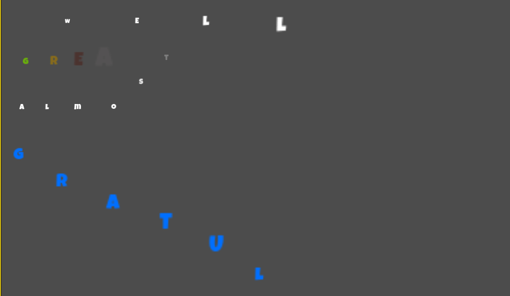

## Godot Animated Text



### For Godot Version 4.x

Addon qucily edited to run on godot 4.x.
Not claiming that it works correctly. Feel free to conribute fixing mistakes.

### For Godot Version 3.x

Animated Text is a modular plugin for creating animated text
sequences for Godot 3.x. The plugin consists of a number of 
components.

1. ```AnimatedText``` A custom node that implements the animated
text functionality.
2. ```AnimatedTextGenerator``` A helper custom node that can be
used to generate character sequences from a text string to be
animated by the ```AnimatedText``` node.
3. ```AnimatedTextEffect...``` A set of default effect nodes that
can be applied to an ```AnimatedText``` node to control the
animation.

_This documentation is preliminary, it will be improved over time._
_Please refer to the example project in the `examples` folder for details of how each element works._

## Usage

The basic usage pattern is as follows...

1. Create an ```AnimatedText``` node in your 2D scene.
2. Under that node create a ```Node2D``` to contain the characters (or other animated 2D nodes).
3. Reference this container node in the ```AnimatedText``` node `Character Container` property.
4. Add another Node2D under the ```AnimatedText``` node to contain your initial effects chain.
5. Add any ```AnimatedTextEffect...``` nodes you want under this container.
6. Reference the effect container node in the ```AnimatedText``` node `Effects` property by
extending the array size and assigning the node.
7. Create your character nodes under the previously created character container node. You can
do this by hand, creating Node2D's in the tree, typically instances of the `animated_text_letter.tscn`
scene, or by adding a ```AnimatedTextGenerator``` node, pointing it to the character container,
setting your preferred text string, and clicking the `Regen` flag, which will generate the characters
properly spaced for you.
8. Click the `Snapshot` flag to take a snapshot of the characters in their initial position, each time
the animation is started, the characters will return to these positions before beginning the animation.
You can move the characters however you like if you'd prefer them to start in a non-default state.
9. Adjust the other parameters such as `Duration`, `Shift` and `Loop`.
10. Click the `Playing` flag to preview the animation in the editor.
11. In order to play the animation in your game, set the `playing` boolean on the ```AnimatedText```
node to true.

The system allows different chains of animation to be applied to a single set of characters, for example
to animate a message onto the screen, and a second to animate it off the screen in a different way. To
use this feature, create another Node2D effect container, add your effects chain, and then add it to the
`Effects` property on the ```AnimatedText``` node. You can choose which animation to play using the
`current_effect` property.

## Effects

### Fade
Documentation TBD

### Function
Documentation TBD

### Path Follow
Documentation TBD

### Scale
Documentation TBD

### Trigger Particles
Documentation TBD
